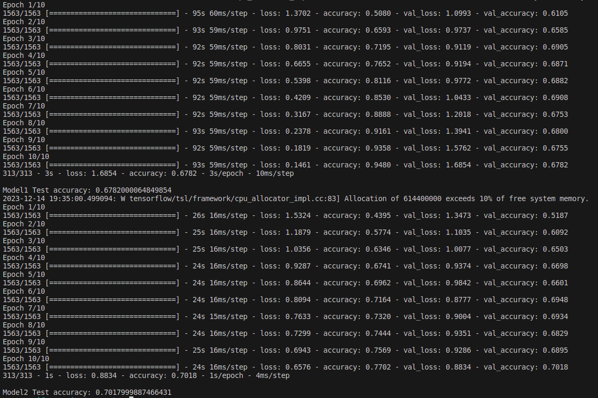
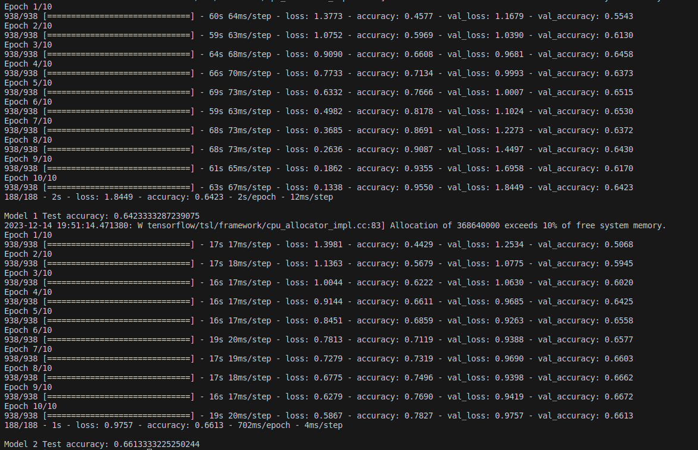

# Neural networks

Neural network training models built with Tensorflow library:

- sonar ([dataset](https://archive.ics.uci.edu/dataset/151/connectionist+bench+sonar+mines+vs+rocks) with accuracy comparison to [data classificator](./../4-data-classification)) and with the confusion matrix output rendered
- animals ([CIFAR10 dataset](https://www.cs.toronto.edu/~kriz/cifar.html)) with comparison of two models with different number of layers and neurons

## How to set up:

Install the packages from the requirements.txt with the following command `pip3 install -r requirements.txt`

## How to run:

For each model, run one of these command in a respective directory:

### sonar

- sonar model: `python3 sonar_model.py`  
  The program will also show the model confusion matrix output.

### animals

- for the whole CIFAR10 dataset `python3 cifar10_model.py`
- for the whole CIFAR10 dataset with comparison of two models with different layers and neurons number `python3 cifar10_models_comparison.py`
- for only animals from CIFAR10 dataset `python3 animal_model.py`
- for only animals from CIFAR10 dataset with comparison of two models with different layers and neurons number `python3 animal_models_comparison.py`

Each program will print the model accuracy to the console.

## Printscreens:

### sonar

Sonar model output:  

Sonar model output confusion matrix:  

Sonar output from [Data Classificator](./../4-data-classification)  

### animals

CIFAR10 two models comparison output:

CIFAR10 limited to animals only two models comparison output:

## Authors:

Adam Łuszcz s22994  
Anna Rogala s21487

## Sources:

- https://www.tensorflow.org/?hl=pl
- https://archive.ics.uci.edu/dataset/151/connectionist+bench+sonar+mines+vs+rocks
- https://www.cs.toronto.edu/~kriz/cifar.html
